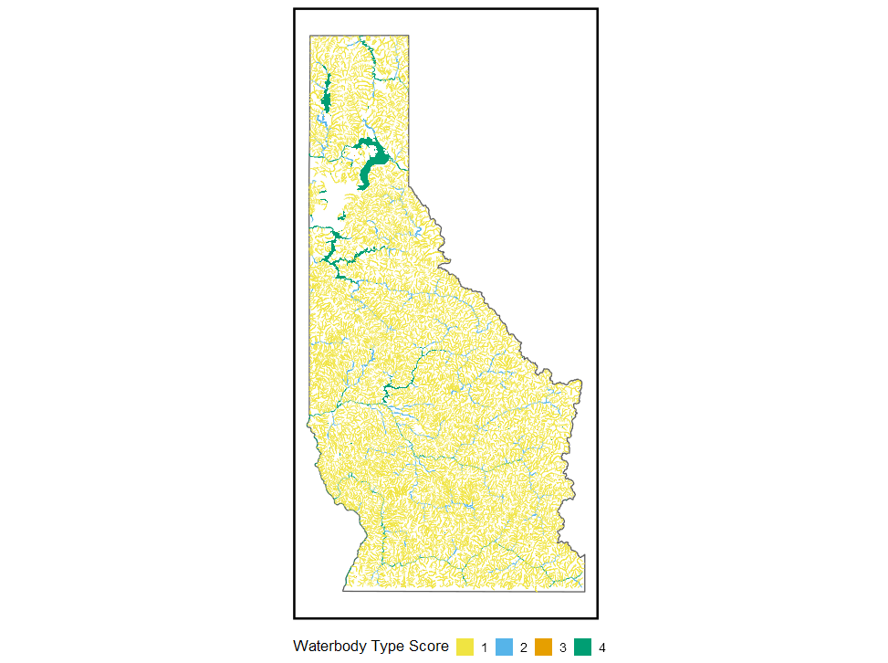
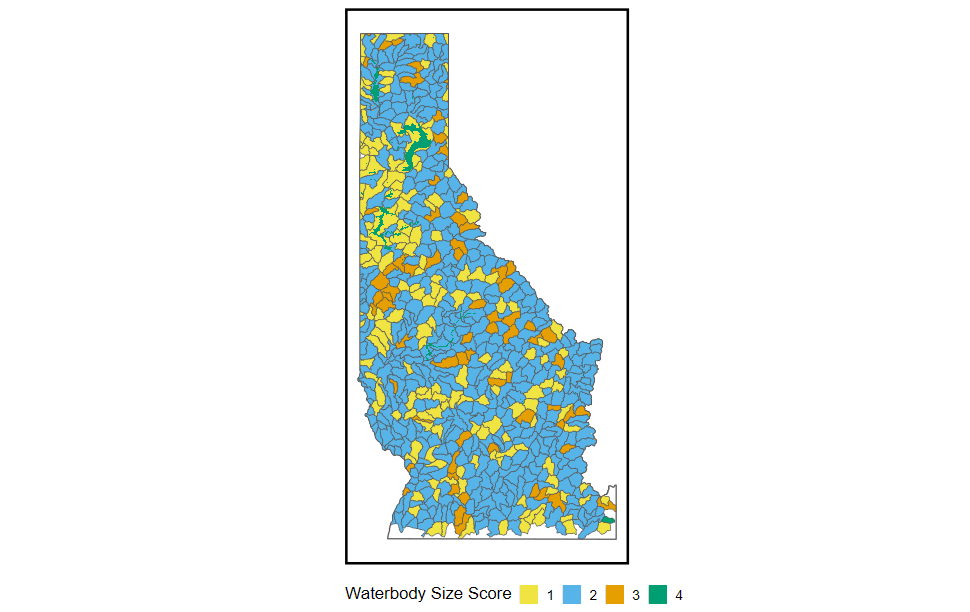
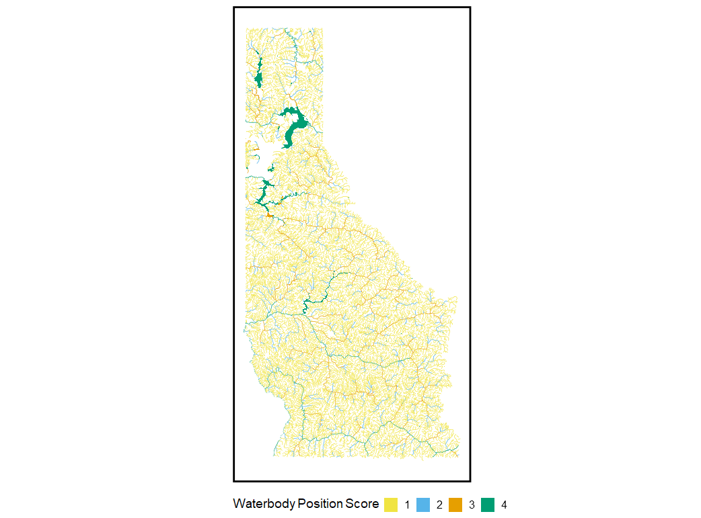
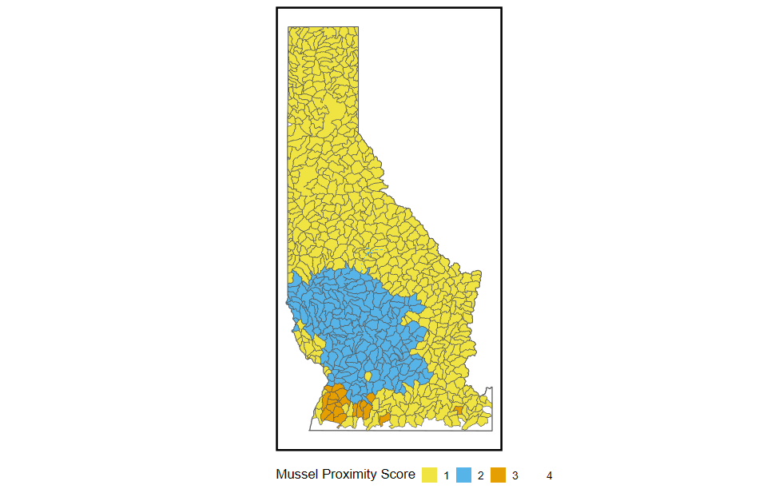
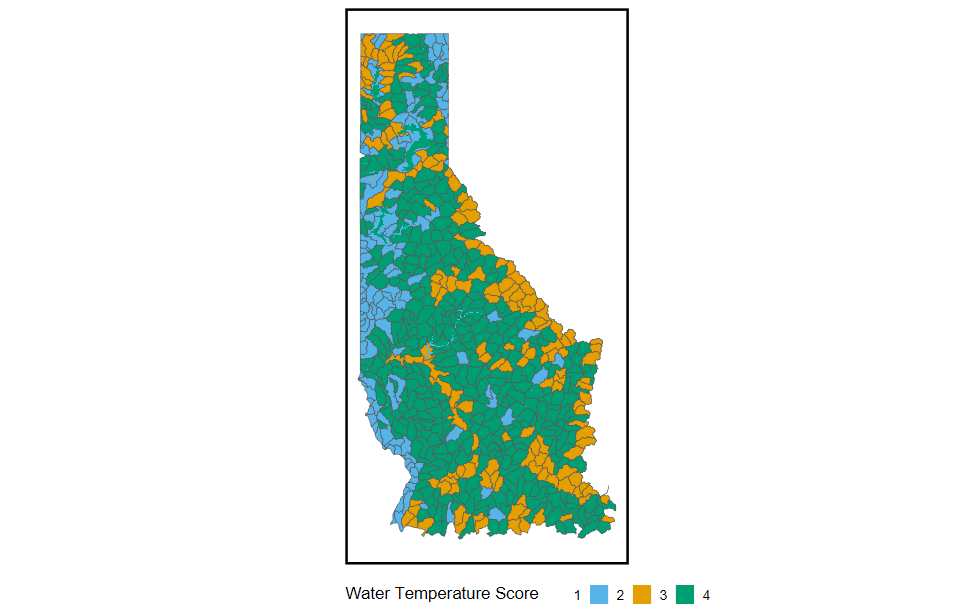
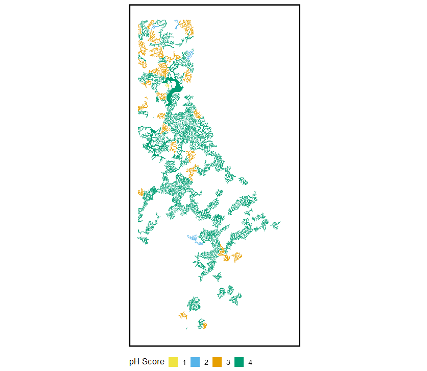
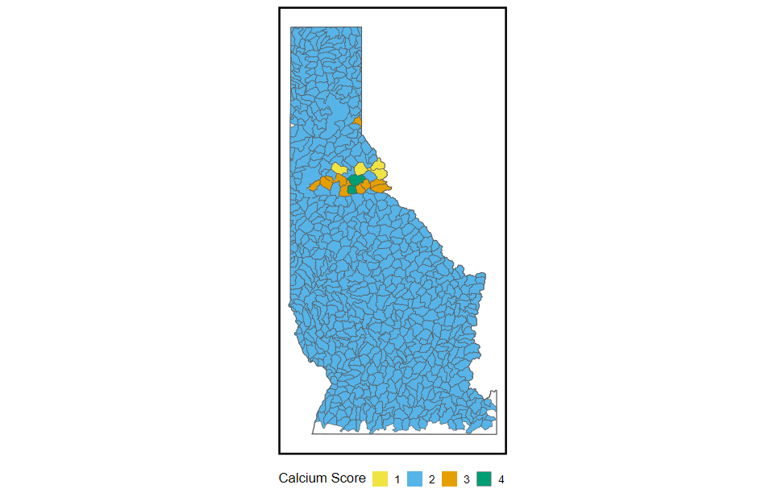
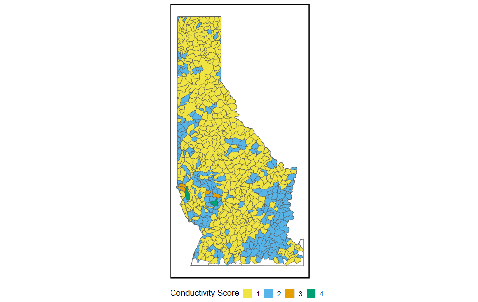

```{r setup, include=FALSE}
knitr::opts_chunk$set(dev.args = list(png = list(type = "cairo")), fig.width = 11, fig.height = 7)

library(sf)
library(tidyverse)
library(resourceviz)
library(colorblindr)
library(ggtext)
library(gt)
library(patchwork)


final_stream <- read_sf('Z:/GIT/aisrisk/data/simple_features.gpkg', layer = 'nhdplus_idaho_final_together')

final_lakes <- read_sf( 'Z:/GIT/aisrisk/data/simple_features.gpkg', layer = 'waterbodies_idaho_final_together')

myColors <- c("#F0E442", "#56B4E9", "#E69F00", "#009E73")

names(myColors) <- factor(1:4)

idaho <- AOI::aoi_get(state = 'Idaho') %>% st_crop(st_transform(final_stream, st_crs(.)))

social_and_habitat_final_final <- bind_rows(final_stream, final_lakes) %>% 
  mutate(across(c(waterbody_type:mussel_proximity, p_h_model:temperature_model), ~ifelse(is.na(.x), 0, .x))) %>%
  mutate(
    summed_social = waterbody_position + waterbody_size_rec + waterbody_type + mussel_proximity,
    summed_habitat = temperature_model + p_h_model + calcium_model + hardness_model + do_model + conductivity_model
  ) %>%
  mutate(
    final_score_social = case_when(
      summed_social > 0 & summed_social <= 5 ~ 1,
      summed_social > 5 & summed_social <= 10 ~ 2,
      summed_social > 10 & summed_social <= 16 ~ 3,
      summed_social > 16 & summed_social <= 24 ~ 4,
    ),
    final_score_habitat = case_when(
      summed_habitat > 0 & summed_habitat <= 5 ~ 1,
      summed_habitat > 5 & summed_habitat <= 10 ~ 2,
      summed_habitat > 10 & summed_habitat <= 16 ~ 3,
      summed_habitat > 16 & summed_habitat <= 24 ~ 4,
    )
  ) %>%
  mutate(
    final_score = case_when(
      final_score_social==4 & final_score_habitat==4 ~ 1,
      final_score_social==4 & final_score_habitat==3 ~ 2,
      final_score_social==3& final_score_habitat==4 ~ 2,
      final_score_social==3& final_score_habitat==3 ~ 3,
      final_score_social==4& final_score_habitat==2 ~ 4,
      final_score_social==4& final_score_habitat==1 ~ 4,
      final_score_social==2& final_score_habitat==4 ~ 4,
      final_score_social==1& final_score_habitat==4 ~ 4,
      final_score_social==3& final_score_habitat==NA_real_ ~ 5,
      final_score_social==NA_real_& final_score_habitat==3 ~ 5,
      final_score_social==3& final_score_habitat==2 ~ 6,
      final_score_social==2& final_score_habitat==3 ~ 6,
      final_score_social==3& final_score_habitat==1 ~ 7,
      final_score_social==1& final_score_habitat==3 ~ 7,
      final_score_social==2& final_score_habitat==2 ~ 8,
      final_score_social==2& final_score_habitat==1 ~ 9,
      final_score_social==1& final_score_habitat==2 ~ 9,
      final_score_social==1 &final_score_habitat==1 ~ 10,
      TRUE ~ NA_real_


    )
  )

social_and_habitat_final_df_final <- social_and_habitat_final_final %>% st_drop_geometry()


final_lakes <- final_lakes %>% 
  mutate(across(c(waterbody_type:mussel_proximity, p_h_model:temperature_model), ~ifelse(is.na(.x), 0, .x))) %>%
  mutate(
    summed_social = waterbody_position + waterbody_size_rec + waterbody_type + mussel_proximity,
    summed_habitat = temperature_model + p_h_model + calcium_model + hardness_model + do_model + conductivity_model
  ) %>%
  mutate(
    final_score_social = case_when(
      summed_social > 0 & summed_social <= 5 ~ 1,
      summed_social > 5 & summed_social <= 10 ~ 2,
      summed_social > 10 & summed_social <= 16 ~ 3,
      summed_social > 16 & summed_social <= 24 ~ 4,
    ),
    final_score_habitat = case_when(
      summed_habitat > 0 & summed_habitat <= 5 ~ 1,
      summed_habitat > 5 & summed_habitat <= 10 ~ 2,
      summed_habitat > 10 & summed_habitat <= 16 ~ 3,
      summed_habitat > 16 & summed_habitat <= 24 ~ 4,
    )
  ) %>%
  mutate(
    final_score = case_when(
      final_score_social==4 & final_score_habitat==4 ~ 1,
      final_score_social==4 & final_score_habitat==3 ~ 2,
      final_score_social==3& final_score_habitat==4 ~ 2,
      final_score_social==3& final_score_habitat==3 ~ 3,
      final_score_social==4& final_score_habitat==2 ~ 4,
      final_score_social==4& final_score_habitat==1 ~ 4,
      final_score_social==2& final_score_habitat==4 ~ 4,
      final_score_social==1& final_score_habitat==4 ~ 4,
      final_score_social==3& final_score_habitat==NA_real_ ~ 5,
      final_score_social==NA_real_& final_score_habitat==3 ~ 5,
      final_score_social==3& final_score_habitat==2 ~ 6,
      final_score_social==2& final_score_habitat==3 ~ 6,
      final_score_social==3& final_score_habitat==1 ~ 7,
      final_score_social==1& final_score_habitat==3 ~ 7,
      final_score_social==2& final_score_habitat==2 ~ 8,
      final_score_social==2& final_score_habitat==1 ~ 9,
      final_score_social==1& final_score_habitat==2 ~ 9,
      final_score_social==1 &final_score_habitat==1 ~ 10,
      TRUE ~ NA_real_


    )
  )

final_stream <- final_stream %>% 
  mutate(across(c(waterbody_type:mussel_proximity, p_h_model:temperature_model), ~ifelse(is.na(.x), 0, .x))) %>%
  mutate(
    summed_social = waterbody_position + waterbody_size_rec + waterbody_type + mussel_proximity,
    summed_habitat = temperature_model + p_h_model + calcium_model + hardness_model + do_model + conductivity_model
  ) %>%
  mutate(
    final_score_social = case_when(
      summed_social > 0 & summed_social <= 5 ~ 1,
      summed_social > 5 & summed_social <= 10 ~ 2,
      summed_social > 10 & summed_social <= 16 ~ 3,
      summed_social > 16 & summed_social <= 24 ~ 4,
    ),
    final_score_habitat = case_when(
      summed_habitat > 0 & summed_habitat <= 5 ~ 1,
      summed_habitat > 5 & summed_habitat <= 10 ~ 2,
      summed_habitat > 10 & summed_habitat <= 16 ~ 3,
      summed_habitat > 16 & summed_habitat <= 24 ~ 4,
    )
  ) %>%
  mutate(
    final_score = case_when(
      final_score_social==4 & final_score_habitat==4 ~ 1,
      final_score_social==4 & final_score_habitat==3 ~ 2,
      final_score_social==3& final_score_habitat==4 ~ 2,
      final_score_social==3& final_score_habitat==3 ~ 3,
      final_score_social==4& final_score_habitat==2 ~ 4,
      final_score_social==4& final_score_habitat==1 ~ 4,
      final_score_social==2& final_score_habitat==4 ~ 4,
      final_score_social==1& final_score_habitat==4 ~ 4,
      final_score_social==3& final_score_habitat==NA_real_ ~ 5,
      final_score_social==NA_real_& final_score_habitat==3 ~ 5,
      final_score_social==3& final_score_habitat==2 ~ 6,
      final_score_social==2& final_score_habitat==3 ~ 6,
      final_score_social==3& final_score_habitat==1 ~ 7,
      final_score_social==1& final_score_habitat==3 ~ 7,
      final_score_social==2& final_score_habitat==2 ~ 8,
      final_score_social==2& final_score_habitat==1 ~ 9,
      final_score_social==1& final_score_habitat==2 ~ 9,
      final_score_social==1 &final_score_habitat==1 ~ 10,
      TRUE ~ NA_real_


    )
  )


```


## Overview    

This is a report that covers the methods used to generate Aquatic Invasive Species (AIS) prioritization in Idaho specifically the Nez-Perce/Clearwater and Idaho Panhandle National Forests. We used methods described by Montana Fish, Wildlife and Parks AIS prioritization lotic and lentic environments to the best we could. Some of the input data is difficult to retrieve due to lack of collection and various unorganized sources, thus there are data gaps that would likely help with these final results.      


## Final Scores  

The final score calculations are done by adding together both social and habitat scores and then fitting into a refined scoring matrix. This forces the scores to be from 1 (highest risk) to 10 (least risk). You'll notice below that there are no scores with 1, 2, or 5 and this can be attributed to the lack of data available in the habitat suitability metrics (1 and 2) as well as 5 being a peculiar scoring designation (no data in either habitat or social), which doesn't happen in our case. Below are the final designations;  


```{r, echo = FALSE, out.width='200%', message=F, error=F, warning=F}

myColorsFinal <- viridis::plasma(n = 10)

names(myColorsFinal) <- factor(1:10)

dummy_sf <- st_sfc(st_point(c(NA_real_, NA_real_)), crs = st_crs(final_stream))

dummy_sf <- st_sf(final_score = factor(1:10, levels = 1:10), geom = dummy_sf)

p1 <- ggplot() +
    geom_sf(data = idaho, fill = NA, linewidth = 0.5) +
    geom_sf(data = dummy_sf, aes(color = final_score, fill = final_score), show.legend = F) +
    geom_sf(data = final_stream , aes(color = factor(final_score)), linewidth = .25, inherit.aes = F) +
    geom_sf(data = final_lakes , aes(fill = factor(final_score)), linewidth = 0, inherit.aes = F) +
    scale_color_manual(values = myColorsFinal, guide = 'none',  name = 'Final Score', na.value = NA) +
    scale_fill_manual(values = myColorsFinal, name = 'Final Score', na.value = NA) +
    resourceviz::custom_theme(map_void = 4) +
    theme(legend.position = 'none')

p2 <- social_and_habitat_final_df_final %>% 
  count(final_score) %>% 
  ggplot(aes(final_score, n))  +   
  geom_col(data = dummy_sf %>% st_drop_geometry() %>% 
             mutate(n = 0, final_score = as.numeric(final_score)) %>% 
             tibble(), aes(final_score, n, fill = factor(final_score))) + 
  scale_fill_manual(values = myColorsFinal) + 
  geom_col(aes(fill = factor(final_score)), color = 'black') + 
  scale_fill_manual(values = myColorsFinal) +
  scale_y_continuous(labels = scales::comma) +
  scale_x_continuous(breaks = scales::pretty_breaks()) + 
  labs(x = 'Final Scores: Social and Habitat',
       fill = 'Final Score') +
  resourceviz::custom_theme()

(p2|p1) + plot_layout(guides = 'collect')

```


## Social Suitability Score {.tabset .tabset-pills}   

The Social Suitability Score is broken into 5 different indicators of potential invasion risk via social proxies. These factors are then stratified into categories 1-4 based on different thresholds (see Tables below). These scores are then used for the final risk score by adding to the Habitat Suitability Score.  

```{r, echo = FALSE, out.width='200%'}
social_and_habitat_final_df_final %>% 
  count(final_score_social) %>% 
  ggplot(aes(final_score_social, n))  +   
   geom_col(aes(fill = factor(final_score_social)), color = 'black') + 
  scale_fill_manual(values = myColors, guide = 'none') +
  scale_y_continuous(labels = scales::comma) +
  labs(x = 'Final Scores Social') +
  resourceviz::custom_theme(font_size = 20,
                            font_family = "Open Sans")
```

1. Waterbody Type - This is simply breaking waters into risk by large lakes being most risk and small streams being less risk.  

2. Waterbody Size - This is a surrogate to recreation based on the idea that the longer the river or larger the lake we would then typically see more recreational use.   

3. Position in Watershed - Position in watershed highlights areas that are lower in the watershed are typically going to be at more risk for AIS due to accessibility and downstream of other waterways.   

4. Mussel Proximity - This is the distance from nearest invasive mussel populations via road network.  

5. Angler Days - These are the days that anglers are fishing and higher days mean higher risk.   

### Waterbody Type   

:::: {style="display: flex;"}

::: {style="flex-basis: 500%;"}
```{r, echo=F, out.width='200%',message=FALSE, warning=FALSE, error=FALSE}

social_and_habitat_final_df_final %>% 
  count(waterbody_type) %>% 
  ggplot(aes(waterbody_type, n))  +   
   geom_col(aes(fill = factor(waterbody_type)), color = 'black') + 
  scale_fill_manual(values = myColors, name = 'pH Score', guide = 'none') +
  scale_y_continuous(labels = scales::comma) +
  labs(x = 'Waterbody Type') +
  resourceviz::custom_theme(font_size = 20,
                            font_family = "Open Sans")
```

:::

::: {style="flex-basis: 250%;"}
```{r, echo = F}
tribble(
  ~`Waterbody Type`, ~Score,
  'Stream/Creek', 1,
  'River', 2,
  'Hatchery water/ small lake < 25 ac',  3,
  'Lake > 25 ac or Very Large River', 4
) %>% 
  gt() %>% 
  data_color(
    columns = Score,
    palette = myColors
  )
  

```

:::

::::  

```{r, echo = F, out.width='200%'}
#   
# dummy_sf <- st_sfc(st_point(c(NA_real_, NA_real_)), crs = st_crs(final_stream))
# 
# dummy_sf <- st_sf(waterbody_type = factor(1:4, levels = 1:4), geom = dummy_sf)
# 
# ggplot() +
#     geom_sf(data = idaho, fill = NA, linewidth = 0.5) +
#     geom_sf(data = dummy_sf, aes(color = waterbody_type, fill = waterbody_type), show.legend = F) +
#     geom_sf(data = final_stream , aes(color = factor(waterbody_type)), linewidth = .25, inherit.aes = F) +
#     geom_sf(data = final_lakes , aes(fill = factor(waterbody_type)), linewidth = 0, inherit.aes = F) +
#     scale_color_manual(values = myColors, guide = 'none',  name = 'Waterbody Type Score', na.value = NA) +
#     scale_fill_manual(values = myColors, name = 'Waterbody Type Score', na.value = NA) +
#     guides(fill = guide_legend(order = 3)) +
#     resourceviz::custom_theme(map_void = 4) +
#     theme(legend.position = 'bottom')
  


```


### Waterbody Size   

:::: {style="display: flex;"}

::: {style="flex-basis: 500%;"}
```{r, echo=F, out.width='200%',message=FALSE, warning=FALSE, error=FALSE}

social_and_habitat_final_df_final %>% 
  count(waterbody_size_rec) %>% 
  ggplot(aes(waterbody_size_rec, n))  +   
   geom_col(aes(fill = factor(waterbody_size_rec)), color = 'black') + 
  scale_fill_manual(values = myColors, name = 'pH Score', guide = 'none') +
  scale_y_continuous(labels = scales::comma) +
  labs(x = 'Waterbody Size') +
  resourceviz::custom_theme(font_size = 20,
                            font_family = "Open Sans")
```

:::

::: {style="flex-basis: 250%;"}


```{r, echo = F}
tribble(
  ~`Waterbody Size`, ~Score,
  '<25% or <15km', 1,
  '26-50% or 16-30km', 2,
  '51-75% or 30-60km',  3,
  '>75% or >60km', 4
) %>% 
  gt() %>% 
  data_color(
    columns = Score,
    palette = myColors
  )
  

```

:::

::::  
```{r, echo=F, out.width='200%'}

# dummy_sf <- st_sfc(st_point(c(NA_real_, NA_real_)), crs = st_crs(final_stream))
# 
# dummy_sf <- st_sf(waterbody_size_rec = factor(1:4, levels = 1:4), geom = dummy_sf)
# 
# ggplot() +
#   geom_sf(data = idaho, fill = NA, linewidth = 0.5) +
#     geom_sf(data = dummy_sf, aes(color = waterbody_size_rec, fill = waterbody_size_rec), show.legend = F) +
#     geom_sf(data = final_stream , aes(color = factor(waterbody_size_rec)), linewidth = .25, inherit.aes = F) +
#     geom_sf(data = final_lakes , aes(fill = factor(waterbody_size_rec)), linewidth = 0, inherit.aes = F) +
#     scale_color_manual(values = myColors, guide = 'none',  name = 'Waterbody Size Score') +
#     scale_fill_manual(values = myColors, name = 'Waterbody Size Score') +
#     guides(fill = guide_legend(order = 3)) +
#     resourceviz::custom_theme(map_void = 4) +
#     theme(legend.position = 'bottom')



```

### Position in Watershed   

:::: {style="display: flex;"}

::: {style="flex-basis: 500%;"}
```{r, echo=F, out.width='200%',message=FALSE, warning=FALSE, error=FALSE}

social_and_habitat_final_df_final %>% 
  count(waterbody_position) %>% 
  ggplot(aes(waterbody_position, n))  +   
   geom_col(aes(fill = factor(waterbody_position)), color = 'black') + 
  scale_fill_manual(values = myColors, name = 'pH Score', guide = 'none') +
  scale_y_continuous(labels = scales::comma) +
  labs(x = 'Waterbody Position') +
  resourceviz::custom_theme(font_size = 20,
                            font_family = "Open Sans")
```

:::

::: {style="flex-basis: 250%;"}
```{r, echo = F}
tribble(
  ~`Waterbody Position`, ~Score,
  'Mountain Stream', 1,
  'Lowland/Prairie Stream', 2,
  'Mountain Lake/Reservoir or Lowland/Prairie River',  3,
  'Lowland Lake/Reservoir', 4
) %>% 
  gt()%>% 
  data_color(
    columns = Score,
    palette = myColors
  )
  

```

:::

::::  
```{r, echo=F, out.width='150%'}

# dummy_sf <- st_sfc(st_point(c(NA_real_, NA_real_)), crs = st_crs(final_stream))
# 
# dummy_sf <- st_sf(waterbody_position = factor(1:4, levels = 1:4), geom = dummy_sf)
# 
# ggplot() +
#   geom_sf(data = idaho, fill = NA, linewidth = 0.5) +
#     geom_sf(data = dummy_sf, aes(color = waterbody_position, fill = waterbody_position), show.legend = F) +
#     geom_sf(data = final_stream , aes(color = factor(waterbody_position)), linewidth = .25, inherit.aes = F) +
#     geom_sf(data = final_lakes , aes(fill = factor(waterbody_position)), linewidth = 0, inherit.aes = F) +
#     scale_color_manual(values = myColors, guide = 'none',  name = 'Waterbody Position Score') +
#     scale_fill_manual(values = myColors, name = 'Waterbody Position Score') +
#     guides(fill = guide_legend(order = 3)) +
#     resourceviz::custom_theme(map_void = 4) +
#     theme(legend.position = 'bottom')



```


### Mussel Proximity   


:::: {style="display: flex;"}

::: {style="flex-basis: 500%;"}
```{r, echo=F, out.width='200%',message=FALSE, warning=FALSE, error=FALSE}

social_and_habitat_final_df_final %>% 
  filter(mussel_proximity != 0 ) %>% 
  count(mussel_proximity) %>% 
  ggplot(aes(mussel_proximity, n))  +   
   geom_col(aes(fill = factor(mussel_proximity)), color = 'black') + 
  scale_fill_manual(values = myColors, name = 'pH Score', guide = 'none') +
  scale_y_continuous(labels = scales::comma) +
  labs(x = 'Mussel Proximity') +
  resourceviz::custom_theme(font_size = 20,
                            font_family = "Open Sans")
```

:::

::: {style="flex-basis: 250%;"}
```{r, echo = F}
tribble(
  ~`Mussel Proximity`, ~Score,
  '> 400 miles', 1,
  '300-400 miles', 2,
  '200-300 miles',  3,
  '< 200 miles', 4
) %>% 
  gt()%>% 
  data_color(
    columns = Score,
    palette = myColors
  )
  

```

:::

::::  
```{r, echo=F, out.width='150%'}

# dummy_sf <- st_sfc(st_point(c(NA_real_, NA_real_)), crs = st_crs(final_stream))
# 
# dummy_sf <- st_sf(mussel_proximity = factor(1:4, levels = 1:4), geom = dummy_sf)
# 
# ggplot() +
#   geom_sf(data = idaho, fill = NA, linewidth = 0.5) +
#     geom_sf(data = dummy_sf, aes(color = mussel_proximity, fill = mussel_proximity), show.legend = F) +
#     geom_sf(data = final_stream , aes(color = factor(mussel_proximity)), linewidth = .25, inherit.aes = F) +
#     geom_sf(data = final_lakes , aes(fill = factor(mussel_proximity)), linewidth = 0, inherit.aes = F) +
#     scale_color_manual(values = myColors, guide = 'none',  name = 'Waterbody Position Score', na.value = NA) +
#     scale_fill_manual(values = myColors, name = 'Mussel Proximity Score', na.value = NA) +
#     guides(fill = guide_legend(order = 3)) +
#     resourceviz::custom_theme(map_void = 4) +
#     theme(legend.position = 'bottom')



```


### Angler Days   

Still need to figure out angler days.  


## Habitat Suitability Score  {.tabset .tabset-pills}    

The Habitat Suitability Score is broken into 6 different indicators of potential risk of invasion via physical conditions. These factors are then stratified into categories 1-4 based on different thresholds (see Tables below). These scores are then used for the final risk score by adding to the Social Suitability Score. Of note, there was a large data gap in some of these variables (calcium, dissolved oxygen, hardness), which will likely effect the overall score since it will be missing these data. This data gap leads to a low score, which it might be, but is structurally biased since the scores are additive.  

```{r, echo = FALSE, out.width='200%', warning=F}
social_and_habitat_final_df_final %>% 
  count(final_score_habitat) %>% 
  ggplot(aes(final_score_habitat, n))  +   
   geom_col(aes(fill = factor(final_score_habitat)), color = 'black') + 
  scale_fill_manual(values = myColors, name = 'pH Score', guide = 'none') +
  scale_y_continuous(labels = scales::comma) +
  labs(x = 'Final Scores Habitat') +
  resourceviz::custom_theme()
```


1. Water Temperature - This breaks water into different levels of risk based on temperature.  

2. pH - This is a surrogate to recreation based on the idea that the longer the river or larger the lake we would then typically see more recreational use.   

3. Hardness - Position in watershed highlights areas that are lower in the watershed are typically going to be at more risk for AIS due to accessibility and downstream of other waterways.   

4. Calcium - This is the distance from nearest invasive mussel populations via road network.  

5. Conductivity - These are the days that anglers are fishing and higher days mean higher risk.  

6. Dissolved Oxygen - These are the days that anglers are fishing and higher days mean higher risk.  

<br>


### Water Temperature    


:::: {style="display: flex;"}

::: {style="flex-basis: 500%;"}
```{r, echo=F, out.width='200%',message=FALSE, warning=FALSE, error=FALSE}

social_and_habitat_final_df_final %>% 
  filter(temperature > 0) %>% 
  ggplot(aes(temperature))  +   
   geom_histogram(aes(y=..density..), fill = NA, color = 'black') + 
   geom_density(aes(y=..density..)) +
  geom_rug(aes(color = factor(temperature_model)), size = 2) +
  scale_color_manual(values = myColors, name = 'Water Temperature Score', guide = 'none') +
  labs(x = 'Water Temperature (f)', subtitle = paste0('n = ', scales::comma(nrow(
social_and_habitat_final_df_final %>% filter(!is.na(temperature_model))))
)) +
  resourceviz::custom_theme(font_size = 20,
                            font_family = "Open Sans")
```

:::

::: {style="flex-basis: 250%;"}
```{r, echo=F}

tribble(
  ~`Water Temp (f)`, ~Score,
  
'0 - 40',	1,
'40.1 - 46',	2,
'46.01 - 56',	3,
'56.01 - 71',	4,
'71.01 - 75',	3,
'75.01 - 83',	2,
'83.01 - 120',	1,
) %>% gt()%>% 
  data_color(
    columns = Score,
    palette = myColors
  )

```
:::

::::  
```{r, echo=FALSE, out.width='150%'}
# 
# dummy_sf <- st_sfc(st_point(c(NA_real_, NA_real_)), crs = st_crs(final_stream))
# 
# dummy_sf <- st_sf(temperature_model = factor(1:4, levels = 1:4), geom = dummy_sf)
# 
# ggplot() +
#     geom_sf(data = dummy_sf, aes(color = temperature_model, fill = temperature_model), show.legend = F) +
#     geom_sf(data = final_stream , aes(color = factor(temperature_model)), linewidth = .25, inherit.aes = F) +
#     geom_sf(data = final_lakes , aes(fill = factor(temperature_model)), linewidth = 0, inherit.aes = F) +
#     scale_color_manual(values = myColors, guide = 'none',  name = 'Stream Temperature Score', na.value = NA) +
#     scale_fill_manual(values = myColors, name = 'Water Temperature Score', na.value = NA) +
#     guides(fill = guide_legend(order = 3)) +
#     resourceviz::custom_theme(map_void = 4) +
#     theme(legend.position = 'bottom')


  
```


### pH  

:::: {style="display: flex;"}

::: {style="flex-basis: 500%;"}
```{r, echo=F, out.width='200%',message=FALSE, warning=FALSE, error=FALSE}

social_and_habitat_final_df_final %>% 
  filter(!is.na(p_h_model), p_h < 15, !is.na(p_h), p_h_model != 0) %>% 
  ggplot(aes(p_h))  +   
   geom_histogram(aes(y=..density..), fill = NA, color = 'black') + 
   geom_density(aes(y=..density..)) +
  geom_rug(aes(color = factor(p_h_model)), size = 2) +
  scale_color_manual(values = myColors, name = 'pH Score', guide = 'none') +
  labs(x = 'pH', subtitle = paste0('n = ', scales::comma(nrow(
social_and_habitat_final_df_final %>% 
  filter( !is.na(p_h_model), p_h < 15))))) +
  resourceviz::custom_theme(font_size = 20,
                            font_family = "Open Sans")
```

:::

::: {style="flex-basis: 250%;"}


```{r, echo=F, fig.align='center'}

tribble(
  ~`pH`, ~Score,
  
'0 - 40',	1,
'40.1 - 46',	2,
'46.01 - 56',	3,
'56.01 - 71',	4,
'71.01 - 75',	3,
'75.01 - 83',	2,
'83.01 - 120',	1,
) %>% gt()%>% 
  data_color(
    columns = Score,
    palette = myColors
  )

```
:::

::::  

```{r, echo=F,out.width='150%',  fig.align='center'}
# 
# dummy_sf <- st_sfc(st_point(c(NA_real_, NA_real_)), crs = st_crs(final_stream))
# 
# dummy_sf <- st_sf(p_h_model = factor(1:4, levels = 1:4), geom = dummy_sf)
# 
# ggplot() +
#     geom_sf(data = dummy_sf, aes(color = p_h_model, fill = p_h_model), show.legend = F) +
#     geom_sf(data = final_stream , aes(color = factor(p_h_model)), linewidth = .25, inherit.aes = F) +
#     geom_sf(data = final_lakes , aes(fill = factor(p_h_model)), linewidth = 0, inherit.aes = F) +
#     scale_color_manual(values = myColors, guide = 'none',  name = 'Stream Temperature Score', na.value = NA) +
#     scale_fill_manual(values = myColors, name = 'pH Score', na.value = NA) +
#     guides(fill = guide_legend(order = 3)) +
#     resourceviz::custom_theme(map_void = 4) +
#     theme(legend.position = 'bottom')



  

```

### Hardness   

:::: {style="display: flex;"}

::: {style="flex-basis: 500%;"}
```{r, echo=F, out.width='200%',message=FALSE, warning=FALSE, error=FALSE}

social_and_habitat_final_df_final %>% 
  filter(!is.na(hardness_model),
         hardness_model != 0) %>% 
  ggplot(aes(hardness)) +   
   geom_histogram(aes(y=..density..), fill = NA, color = 'black') + 
   geom_density(aes(y=..density..)) +
  geom_rug(aes(color = factor(hardness_model)), size = 2) +
  scale_color_manual(values = myColors, name = 'pH Score', guide = 'none') +
  labs(x = 'Hardness',
       subtitle = paste0('n = ', scales::comma(nrow(social_and_habitat_final_df_final %>% 
                                                      filter(!is.na(hardness_model),
         hardness_model != 0))))
       ) +
  resourceviz::custom_theme(font_size = 20,
                            font_family = "Open Sans")
```


:::

::: {style="flex-basis: 250%;"}


```{r, echo=F, fig.align='center'}

tribble(
  ~`Hardness`, ~Score,
  
'0 - 50',1,
'50.1 - 99',2,
'100 - 125',3,
'125 - 1000',4,
) %>% gt()%>% 
  data_color(
    columns = Score,
    palette = myColors
  )

```

:::


::::  

```{r, echo=F,out.width='150%',  fig.align='center'}

# dummy_sf <- st_sfc(st_point(c(NA_real_, NA_real_)), crs = st_crs(final_stream))
# 
# dummy_sf <- st_sf(hardness_model = factor(1:4, levels = 1:4), geom = dummy_sf)
# 
# ggplot() +
#     geom_sf(data = idaho, fill = NA, linewidth = 0.5) +
#     geom_sf(data = dummy_sf, aes(color = hardness_model, fill = hardness_model), show.legend = F) +
#     geom_sf(data = final_stream , aes(color = factor(hardness_model)), linewidth = .25, inherit.aes = F) +
#     geom_sf(data = final_lakes , aes(fill = factor(hardness_model)), linewidth = 0, inherit.aes = F) +
#     scale_color_manual(values = myColors, guide = 'none',  name = 'Stream Temperature Score', na.value = NA) +
#     scale_fill_manual(values = myColors, name = 'Hardness Score', na.value = NA) +
#     guides(fill = guide_legend(order = 3)) +
#     resourceviz::custom_theme(map_void = 4) +
#     theme(legend.position = 'bottom')


```


### Calcium  

:::: {style="display: flex;"}

::: {style="flex-basis: 500%;"}
```{r, echo=F, out.width='200%',message=FALSE, warning=FALSE, error=FALSE}

social_and_habitat_final_df_final %>% filter(calcium > 0, !is.na(calcium_model)) %>% 
  ggplot(aes(calcium))  +   
   geom_histogram(aes(y=..density..), fill = NA, color = 'black') + 
   geom_density(aes(y=..density..)) +
  geom_rug(aes(color = factor(calcium_model)), size = 2) +
  scale_color_manual(values = myColors, name = 'pH Score', guide = 'none') +
  labs(x = 'Calcium',
       subtitle = paste0('n = ', scales::comma(nrow(social_and_habitat_final_df_final %>% filter(calcium > 0, !is.na(calcium_model)))))) +
  resourceviz::custom_theme(font_size = 20,
                            font_family = "Open Sans")
```

:::

::: {style="flex-basis: 250%;"}

```{r, echo=F, fig.align='center'}

tribble(
  ~`Calcium`, ~Score,
  
'0 - 4',1,
'4.1 - 13',2,
'13.1 - 24',3,
'24.1 - 100',4,
) %>% gt()%>% 
  data_color(
    columns = Score,
    palette = myColors
  )

```

:::

::::
```{r, echo=F,out.width='150%',  fig.align='center'}
# 
# 
# dummy_sf <- st_sfc(st_point(c(NA_real_, NA_real_)), crs = st_crs(final_stream))
# 
# dummy_sf <- st_sf(calcium_model = factor(1:4, levels = 1:4), geom = dummy_sf)
# 
# ggplot() +
#     geom_sf(data = idaho, fill = NA, linewidth = 0.5) +
#     geom_sf(data = dummy_sf, aes(color = calcium_model, fill = calcium_model), show.legend = F) +
#     geom_sf(data = final_stream , aes(color = factor(calcium_model)), linewidth = .25, inherit.aes = F) +
#     geom_sf(data = final_lakes , aes(fill = factor(calcium_model)), linewidth = 0, inherit.aes = F) +
#     scale_color_manual(values = myColors, guide = 'none',  name = 'Stream Temperature Score', na.value = NA) +
#     scale_fill_manual(values = myColors, name = 'Calcium Score', na.value = NA) +
#     guides(fill = guide_legend(order = 3)) +
#     resourceviz::custom_theme(map_void = 4) +
#     theme(legend.position = 'bottom')


```


### Conductivity  

:::: {style="display: flex;"}

::: {style="flex-basis: 500%;"}
```{r, echo=F, out.width='200%',message=FALSE, warning=FALSE, error=FALSE}

social_and_habitat_final_df_final %>% filter(conductivity > 0, !is.na(conductivity_model)) %>% 
  ggplot(aes(conductivity))  +   
   geom_histogram(aes(y=..density..), fill = NA, color = 'black') + 
   geom_density(aes(y=..density..)) +
  geom_rug(aes(color = factor(conductivity_model)), size = 2) +
  scale_color_manual(values = myColors, name = 'pH Score', guide = 'none') +
  labs(x = 'Conductivity',
       subtitle = paste0('n = ', scales::comma(nrow(social_and_habitat_final_df_final %>% filter(conductivity > 0, !is.na(conductivity_model)))))) +
  resourceviz::custom_theme(font_size = 20,
                            font_family = "Open Sans")
```

:::

::: {style="flex-basis: 250%;"}
```{r, echo=F, fig.align='center'}

tribble(
  ~`Conductivity`, ~Score,
  
'0 - 490',1,
'491 - 989',2,
'990 - 1499',3,
'1500 - 3000',4,
) %>% gt()%>% 
  data_color(
    columns = Score,
    palette = myColors
  )

```

:::

::::  

```{r, echo=F,out.width='150%',  fig.align='center'}

# 
# dummy_sf <- st_sfc(st_point(c(NA_real_, NA_real_)), crs = st_crs(final_stream))
# 
# dummy_sf <- st_sf(conductivity_model = factor(1:4, levels = 1:4), geom = dummy_sf)
# 
# ggplot() +
#   geom_sf(data = idaho, fill = NA, linewidth = 0.5) +
#     geom_sf(data = dummy_sf, aes(color = conductivity_model, fill = conductivity_model), show.legend = F) +
#     geom_sf(data = final_stream , aes(color = factor(conductivity_model)), linewidth = .25, inherit.aes = F) +
#     geom_sf(data = final_lakes , aes(fill = factor(conductivity_model)), linewidth = 0, inherit.aes = F) +
#     scale_color_manual(values = myColors, guide = 'none',  name = 'Stream Temperature Score', na.value = NA) +
#     scale_fill_manual(values = myColors, name = 'Conductivity Score', na.value = NA) +
#     guides(fill = guide_legend(order = 3)) +
#     resourceviz::custom_theme(map_void = 4) +
#     theme(legend.position = 'bottom')


```


### Dissolved Oxygen  

:::: {style="display: flex;"}

::: {style="flex-basis: 500%;"}
```{r, echo=F, out.width='200%',message=FALSE, warning=FALSE, error=FALSE}

social_and_habitat_final_df_final %>% filter(dissolved_oxygen > 0, !is.na(do_model)) %>% 
  ggplot(aes(dissolved_oxygen))  +   
   geom_histogram(aes(y=..density..), fill = NA, color = 'black') + 
   geom_density(aes(y=..density..)) +
  geom_rug(aes(color = factor(do_model)), size = 2) +
  scale_color_manual(values = myColors, name = 'pH Score', guide = 'none') +
  labs(x = 'Dissolved Oxygen',
       subtitle = paste0('n = ', scales::comma(nrow(social_and_habitat_final_df_final %>% filter(dissolved_oxygen > 0, !is.na(do_model)))))) +
  resourceviz::custom_theme(font_size = 20,
                            font_family = "Open Sans")
```

:::

::: {style="flex-basis: 250%;"}
```{r, echo=F, fig.align='center'}

tribble(
  ~`Dissolved Oxygen`, ~Score,
  
'0 - 3',1,
'3.1 - 7',2,
'7.1 - 12',3,
'12.1 - 50',4,
) %>% gt()%>% 
  data_color(
    columns = Score,
    palette = myColors
  )

```

:::

::::


```{r, echo=F,out.width='150%',  fig.align='center'}

# 
# dummy_sf <- st_sfc(st_point(c(NA_real_, NA_real_)), crs = st_crs(final_stream))
# 
# dummy_sf <- st_sf(do_model = factor(1:4, levels = 1:4), geom = dummy_sf)
# 
# ggplot() +
#   geom_sf(data = idaho, fill = NA, linewidth = 0.5) +
#     geom_sf(data = dummy_sf, aes(color = do_model, fill = do_model), show.legend = F) +
#     geom_sf(data = final_stream , aes(color = factor(do_model)), linewidth = .25, inherit.aes = F) +
#     geom_sf(data = final_lakes , aes(fill = factor(do_model)), linewidth = 0, inherit.aes = F) +
#     scale_color_manual(values = myColors, guide = 'none',  name = 'Stream Temperature Score', na.value = NA) +
#     scale_fill_manual(values = myColors, name = 'Dissolved Oxygen Score', na.value = NA) +
#     guides(fill = guide_legend(order = 3)) +
#     resourceviz::custom_theme(map_void = 4) +
#     theme(legend.position = 'bottom')

knitr::include_graphics('www/images/do_model.png')

```

