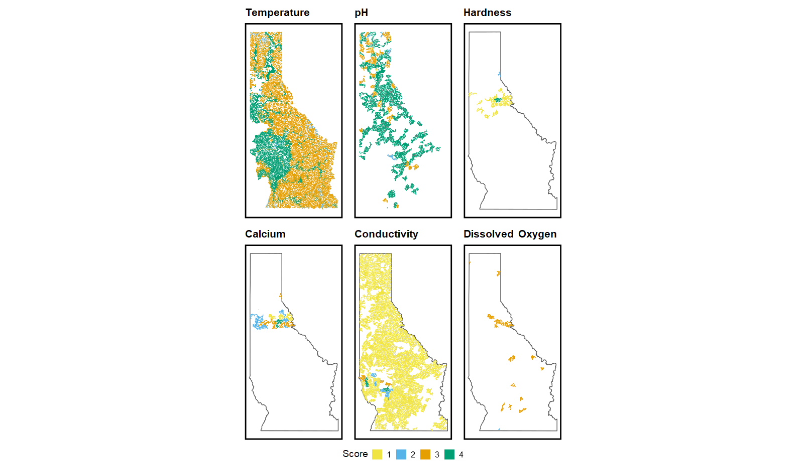

```{r setup, include=FALSE}
knitr::opts_chunk$set(dev.args = list(png = list(type = "cairo")), fig.width = 11, fig.height = 7)
library(dplyr)
library(gt)


myColors <- c("#F0E442", "#56B4E9", "#E69F00", "#009E73")

names(myColors) <- factor(1:4)

```


# Overview  

This is the GIS workflow that covers the habitat suitability methods used to generate Aquatic Invasive Species (AIS) prioritization in Idaho specifically the Nez-Perce/Clearwater and Idaho Panhandle National Forests. We used methods described by Montana Fish, Wildlife and Parks AIS prioritization for lotic and lentic environments to the best we could.  

In this vignette, there will be some steps that will take time to process (~mins) and can take up a decent amount of memory (> 1 Gb) so please *be warned* before running the code below. Getting the specific data with this model was difficult due to various metrics, sources and collection history. This lead to a lot of areas lacking data (see Figure below) and affecting the final model output. Eventually, the idea is to bring in a Bayesian analysis framework to help with the scattered data. For now, we will just stay with the existing framework.   

Again, our goal with the vignette is to show the steps it took to get to the figure output below.  


```{r, echo = F, out.width='250%', fig.cap="Final habitat scores for the six metrics. Notice there is a lot of missing data with certain metrics." }
  


```


### Data  

The data retrieval part of this model is very intensive and requires some webscraping and http retrieval skills. There are three main sources we are going to get data from;  

1. (NorWest Stream Temperature)[https://www.fs.usda.gov/rm/boise/AWAE/projects/NorWeST.html].  

2. (Water Quality Portal (WQP))[https://www.waterqualitydata.us/].  

3. (Beneficial Use Reconnaissance Program (BURP))[https://www2.deq.idaho.gov/water/BurpViewer/].  

We'll go through each step in getting the data and then bringing it all together at the end. You'll also need the `nhdplus_idaho_final_social` and `waterbody_idaho_final_social` data from the social vignette at the very end to join it all together.  

### Stream Temperature  

To get the stream temperature data we'll use NorWest modelled stream temperature data for August (Isaak et al., 2017). We'll get this via the {fishguts} package and select appropriate watersheds, for more information see `?fishguts::get_NorWestStreams`.  

```{r, eval=FALSE}
library(sf)
library(tidyverse)

#### bring in water temp from NorWest

spokoot <- fishguts::get_NorWestStreams('SpoKoot')

cwb <- fishguts::get_NorWestStreams('Clearwater River Basin')

srb <- fishguts::get_NorWestStreams('Salmon River Basin')

middle_columbia <- fishguts::get_NorWestStreams('Middle Columbia')

idaho <- AOI::aoi_get(state = 'idaho')

stream_temp_id <- bind_rows(st_as_sf(spokoot), st_as_sf(cwb), st_as_sf(srb), st_as_sf(middle_columbia))

stream_temp_id <- stream_temp_id %>% st_as_sf() %>% st_intersection(st_transform(idaho, st_crs(stream_temp_id)))

```

What's nice about this dataset is it's linked to our other dataset (`nhdplus_idaho`) by `comid`. Since there isn't any stream temperature associated with the NorWest Streams dataset and waterbodies we tried to get some from both WQP and BURP; however, there wasn't any water temperature associated with waterbodies. There was water temperature data that was collected with AIS monitoring in previous years so we used that data to fill the gap within waterbodies the best we could.  

```{r, eval = FALSE}

#### create an empty list to put previous years data into 

monitorings_sites_quagga_zebra <- list() 

library(arcgis)
# loop through and call ESRI api
for (i in c(1:8)){

monitorings_sites_quagga_zebra[[i]] <- arc_select(arc_open(paste0('https://gis.psmfc.org/server/rest/services/WesternAIS/Quagga_and_Zebra_Mussel_Monitoring_Sites/MapServer/', i)))


}

# clean up weird character geometries
monitorings_sites_quagga_zebra_sf <- bind_rows(monitorings_sites_quagga_zebra) %>% st_as_sf()

monitorings_sites_quagga_zebra_sf$geom_char <- map(st_geometry(monitorings_sites_quagga_zebra_sf), ~is.numeric(.x[[1]])) %>%
                                                unlist()

monitorings_sites_quagga_zebra_sf <- monitorings_sites_quagga_zebra_sf %>% filter(geom_char)


monitorings_sites_quagga_zebra_sf <- monitorings_sites_quagga_zebra_sf[!st_is_empty(st_zm(monitorings_sites_quagga_zebra_sf)),,drop=FALSE]

# filter and clean up

ais_list <- monitorings_sites_quagga_zebra_sf %>% st_intersects(st_transform(idaho, st_crs(monitorings_sites_quagga_zebra_sf)))

ais_list <- lengths(ais_list) > 0

# now we'll have each site within idaho

monitorings_sites_quagga_zebra_sf <- monitorings_sites_quagga_zebra_sf[ais_list,]


# you could really try and get as much as you can but 
# for our area the water temp is the most robust so we'll stick with that

# clean up

monitorings_sites_quagga_zebra_sf <- monitorings_sites_quagga_zebra_sf %>% 
                                     filter(!is.na(WATERTEMPF)) %>% 
                                     select(temperature_water = 'WATERTEMPF')

```


### Water Quality Portal  

You'll need to access the WQP data to get the rest of the scores. I'd recommend some sort of query call through an API or download via the website. Below is a way to do this using the {dataRetrieval} package.  

This will take a while to download and also will take a decent amount of space (> Gb) so be aware before running!


```{r, eval=FALSE}

# we'll use these characteristic names to query the WQP

wq_names <- c(
                "pH", "Bicarbonate",                                              
                "Calcium", "Calcium carbonate",                                      
                "Hardness, Ca, Mg", "Dissolved oxygen saturation",                                
                "Dissolved oxygen (DO)", "Conductivity",                                               
                "Hardness, non-carbonate", "Alkalinity, carbonate" ,                                     
                "Alkalinity, bicarbonate", "Hardness, magnesium" ,                                       
                "Hardness, carbonate", "Total hardness",                                             
                "Alkalinity, Phenolphthalein (total hydroxide+1/2 carbonate)", "Specific conductivity",                                      
                "Hardness", "Calcium as CaCO3" ,                                          
                "Alkalinity, Bicarbonate as CaCO3"
                )

# Also, keep it to Idaho and within water.
wqp_idaho <- dataRetrieval::readWQPdata(statecode = 'ID',
                                        characteristicName = wq_names,
                                        sampleMedia = 'Water')

### we'll use this to intersect the huc12s and waterbodies

wqp_idaho_site_info <- attr(wqp_idaho, 'siteInfo')

wqp_idaho_sf <- st_as_sf(wqp_idaho_site_info %>% filter(!is.na(dec_lon_va)), coords = c('dec_lon_va', 'dec_lat_va'), crs = 4326)

# now combined with HUCS to make easier.

huc12 <- read_sf('data/simple_features.gpkg', layer = 'huc12')

huc_list <- st_intersects(wqp_idaho_sf, st_transform(huc12, crs = st_crs(wqp_idaho_sf)))

huc_list <- map_vec(huc_list, ~ifelse(is.null(.x), NA, .x))

# now we'll have each site iwth a huc12 

wqp_idaho_sf$huc12 <- huc12[huc_list,]$huc12

```

Before we move to the BURP data retrieval, we'll clean up the WQP data some more to remove some unwanted locations.  

```{r, eval=FALSE}

wqp_idaho_filtered <-   wqp_idaho %>% 
                        filter(ResultSampleFractionText  %in% c('Total', 'Filtered, lab'),
                               ActivityMediaSubdivisionName == "Surface Water") %>%
                        mutate(ResultMeasureValue = readr::parse_number(ResultMeasureValue),
                               ResultMeasureValue  = if_else(ResultMeasure.MeasureUnitCode  %in% c('ug/L', 'ug/l'),
                                                             ResultMeasureValue*0.001, ResultMeasureValue),
                               ResultMeasure.MeasureUnitCode = if_else(ResultMeasure.MeasureUnitCode  %in% c('ug/L', 'ug/l'),
                                                                       'mg/L',ResultMeasure.MeasureUnitCode)) %>%
                        janitor::clean_names() %>% 
                        tibble()%>%
                        mutate(date = lubridate::date(activity_start_date_time)) %>% 
                        group_by(monitoring_location_identifier, date) %>% 
                        mutate(result_measure_value = mean(result_measure_value, na.rm = T)) %>% 
                        slice(1) %>% 
                        ungroup()

# now add the huc12 id to join later with BURP, etc

wqp_idaho_filtered <- wqp_idaho_filtered %>% 
                      left_join(wqp_idaho_sf %>% st_drop_geometry() %>% 
                                select(huc12,monitoring_location_identifier = 'MonitoringLocationIdentifier'))
```


### BURP  

This is a very hacky-way to get a bunch of data off a website that might not be possible otherwise.  

The first step is to get the site ids from the BURP data.  

```{r, eval=FALSE}
library(httr2)
library(tidyverse)

#### Now try and get the BURP data
site_ids <- vector()

for(i in c(1994:2008, 2010:2023)) {

      url_sites <- paste0('https://www2.deq.idaho.gov/water/BurpViewer/Menu?Year=', i)

      req <- request(url_sites)

      req_body <- req %>% req_perform()

      # get ids
      ids <- readLines(req_body$url)

      keywords <- paste0(i,"[A-Z0-9]+")

      si <- na.omit(str_extract(ids, keywords))

      site_ids <- append(site_ids, si)


}

# get the ids

site_ids_filtered <- str_unique(site_ids)

```


Step 2: create a function to scrape the html on the website lists and table per site per year.  

```{r , eval = F}

# get info from ids

burp_func <- function(id){

      url_streams <- paste0('https://www2.deq.idaho.gov/water/BurpViewer/BurpSite/Stream?BurpID=', id)

      req <- request(url_streams)

      req_body <- req %>% req_perform()

      stream_html <- req_body %>% resp_body_html()

      values <- stream_html %>%
      rvest::html_elements(xpath = "//span[@class='readOnly']/text()") %>%
      rvest::html_text2()

      labels <- stream_html %>%
        rvest::html_elements(xpath = "//div[@class='oneThird']/label/text()") %>%
        rvest::html_text2()

      meta_label <- stream_html %>%
        rvest::html_elements(xpath = "//div[@id='leftCol']//ul/li/text()") %>%
        rvest::html_text2()

      meta <- stream_html %>%
        rvest::html_elements(xpath = "//div[@id='leftCol']//ul/li/strong/text()") %>%
        rvest::html_text2()


      meta <- stream_html %>%
        rvest::html_elements(xpath = "//div[@id='leftCol']//ul/li/strong/text()") %>%
        rvest::html_text2()

      md <- tibble(
        labels = meta_label[-2],
        value = meta
      )


      url_location <- paste0('https://www2.deq.idaho.gov/water/BurpViewer/BurpSite/Location?BurpID=', id)

      req <- request(url_location)

      req_body <- req %>% req_perform()

      location_html <- req_body %>% resp_body_html()

      values_loc <- location_html %>%
        rvest::html_elements(xpath = "//div[@class='half']//label/text()") %>%
        rvest::html_text2()

      labels_loc <- location_html %>%
        rvest::html_elements(xpath = "//span[@class='readOnly']/text()") %>%
        rvest::html_text2()


      site_info <- tibble(labels = labels,
                          values = values,
                          sample_year = md[2,2]$value,
                          stream = md[3,2]$value,
                          assessment_unit = md[4,2]$value,
                          site_id = id)%>%
        pivot_wider(names_from = labels, values_from = values) %>%
        janitor::clean_names()

      location_info <- tibble(labels = labels_loc,
                          values = values_loc,
                          site_id = id) %>%
                        pivot_wider(names_from = values, values_from = labels) %>%
                        janitor::clean_names()

      left_join(site_info, location_info)

}


```

Step 3: run this function in parallel and crawl all over that webpage.  

```{r, eval = FALSE}

library(future)
plan(multisession(workers = availableCores()-1))

test <- site_ids_filtered %>%
        furrr::future_map(purrr::safely(~burp_func(.)))

burp_final <- test %>%
  purrr::keep(~length(.) != 0) %>%
  purrr::map(~.x[['result']]) %>%
  plyr::rbind.fill()

#### now clean up and make a spatial copy

burp_final_cleaned <- burp_final %>%
  mutate(across(everything(), ~ifelse(.x  %in% c('No Data', 'NA m', ' ', '', 'mg/l'), NA_real_, .x))) %>%
  mutate(across(c(air_temperature:total_reach_length, stream_order), ~parse_number(.x))) %>%
  filter(latitude > 0,
         site_id != '2001SPOCA029',
         p_h < 15,
         p_h > 0)

burp_final_cleaned_sf <- burp_final_cleaned %>% sf::st_as_sf(coords = c('longitude', 'latitude'), crs = 4326)

#now intersect with huc12

huc_list <- st_intersects(burp_final_cleaned_sf, st_transform(huc12, crs = st_crs(burp_final_cleaned_sf)))

huc_list <- map_vec(huc_list, ~ifelse(is.null(.x), NA, .x))

# now we'll have each site iwth a huc12 

burp_final_cleaned_sf$huc12 <- huc12[huc_list,]$huc12

# write if need be...

# write_csv(burp_final_cleaned, 'data/burp_sites_cleaned_1994-2023.csv')
# write_sf(burp_final_cleaned_sf, 'data/simple_features.gpkg', layer = 'burp_final_cleaned_sf')
```


### Bring it all together  

Finally! We can now start to bring it all together.  

```{r, eval = F}


wqp_idaho_filtered_summarized <- wqp_idaho_filtered %>% 
                                 select(characteristic_name, result_measure_value,
                                        monitoring_location_identifier, huc12, 
                                        date) %>% 
                                 pivot_wider(names_from = 'characteristic_name',
                                             values_from = 'result_measure_value') %>% 
                                 janitor::clean_names() %>% 
                                 group_by(huc12) %>% 
                                 summarise(across(p_h:hardness_non_carbonate, ~mean(.x, na.rm = TRUE))) %>% 
                                 select(huc12,
                                        p_h,
                                        calcium,
                                        conductivity,
                                        temperature_water,
                                        hardness = 'hardness_ca_mg', 
                                        dissolved_oxygen = 'dissolved_oxygen_do')
                                 
# now do the same with the BURP data

burp_final_cleaned_summarized <- burp_final_cleaned_sf %>% 
                                 st_drop_geometry() %>% 
                                 select(huc12, conductivity:dissolved_oxygen) %>% 
                                 group_by(huc12) %>% 
                                 summarise(across(conductivity:dissolved_oxygen, ~mean(.x, na.rm = TRUE))) 
                                
                                 
# now bind together and group summarize by huc12

all_together_burp_wqp <- bind_rows(wqp_idaho_filtered_summarized, burp_final_cleaned_summarized) %>% 
                   group_by(huc12) %>% 
                   summarise(across(everything(), ~mean(.x, na.rm = TRUE)))

# now we can do a long if/else

final_ish_model <- all_together_burp_wqp %>%
  mutate(
    p_h_model = case_when(
    p_h > 0 & p_h <= 3.9 ~ 1,
    p_h > 4 & p_h <= 5.4~ 2,
    p_h > 5.5 & p_h <= 6.9 ~ 3,
    p_h > 7 & p_h <= 9.9 ~ 4,
    p_h > 10 & p_h <= 11 ~ 3,
    p_h > 11 & p_h <= 13 ~ 2,
    p_h > 13 & p_h <= 14 ~ 1,
    TRUE ~ NA
  ),
    calcium_model = case_when(
    calcium > 0 & calcium <= 4 ~ 1,
    calcium > 4 & calcium <= 13~ 2,
    calcium > 13 & calcium <= 24 ~ 3,
    calcium > 24 & calcium <= 100 ~ 4,
    TRUE ~ NA
  ),
    hardness_model = case_when(
    hardness > 0 & hardness <= 50 ~ 1,
    hardness > 50 & hardness <= 99~ 2,
    hardness > 99 & hardness <= 125 ~ 3,
    hardness > 125 & hardness <= 1000 ~ 4,
    TRUE ~ NA
  ),
    do_model = case_when(
    dissolved_oxygen > 0 & dissolved_oxygen <= 3 ~ 1,
    dissolved_oxygen > 3 & dissolved_oxygen <= 7~ 2,
    dissolved_oxygen > 7 & dissolved_oxygen <= 12 ~ 3,
    dissolved_oxygen > 12 & dissolved_oxygen <= 50 ~ 4,
    TRUE ~ NA
  ),
    conductivity_model = case_when(
    conductivity > 0 & conductivity <= 490 ~ 1,
    conductivity > 490 & conductivity <= 989~ 2,
    conductivity > 989 & conductivity <= 1499 ~ 3,
    conductivity > 1499 & conductivity <= 3000 ~ 4,
    TRUE ~ NA
  )
  )

```

You'll start to notice that a lot of the output is `NA`. This is due to the lack of data across our domain for these water quality measurements. It will not be counted with the current model but a future model might look into some sort of regularization or prior to help with the missing data.  

All we need to do now is calculate the stream temperature cutoffs and then bring everything back to waterbodies and flowlines.  

```{r, eval=F}

stream_temp_id <- stream_temp_id %>% 
    rename(temperature_water = 'S2_02_11') %>% 
    mutate(
    temperature_water = (temperature_water*9/5) + 32, 
    temperature_model = case_when(
      temperature_water > 0 & temperature_water <= 40 ~ 1,
      temperature_water > 40 & temperature_water <= 46~ 2,
      temperature_water > 46& temperature_water <= 56 ~ 3,
      temperature_water > 56 & temperature_water <= 71 ~ 4,
      temperature_water > 71 & temperature_water <= 75 ~ 3,
      temperature_water > 75 & temperature_water <= 83 ~ 2,
      temperature_water > 83 & temperature_water <= 120 ~ 1,
      TRUE ~ NA
    )) %>% 
    st_drop_geometry() %>% 
    select(comid = 'COMID', temperature = 'temperature_water', temperature_model)


```

Bring in the previously created datasets `nhdplus_idaho_final_social` and `waterbodies_idaho_final_social`.  

```{r, eval=F}

nhdplus_idaho <- read_sf('data/simple_features.gpkg', layer = 'nhdplus_idaho_final_social')

waterbodies_idaho <- read_sf('data/simple_features.gpkg', layer = 'waterbodies_idaho_final_social')

nhdplus_idaho_final_together <- nhdplus_idaho %>% select(comid, huc12, starts_with('waterbody_'), mussel_proximity) %>% 
                                left_join(final_ish_model) %>% 
                                left_join(stream_temp_id %>% select(comid, temperature, temperature_model)) 

# now for the special case waterbodies
# bc NA's for all stream_temp_id

wb_temp_list <- monitorings_sites_quagga_zebra_sf %>% st_intersects(st_transform(waterbodies_idaho, st_crs(.)))

wb_temp_list <- lengths(wb_temp_list) > 0

stream_temp_wb <- monitorings_sites_quagga_zebra_sf[wb_temp_list,]

stream_temp_wb <- stream_temp_wb %>% st_intersection(st_transform(waterbodies_idaho, st_crs(.)))


stream_temp_wb <- stream_temp_wb %>% 
    mutate(temperature_water = if_else(temperature_water < 32, (temperature_water*9/5) + 32, temperature_water)) %>% 
    group_by(comid) %>% 
    mutate(temperature_water = mean(temperature_water, na.rm = TRUE)) %>% 
    slice(1) %>% 
    ungroup() %>% 
    mutate( 
    temperature_model = case_when(
      temperature_water > 0 & temperature_water <= 40 ~ 1,
      temperature_water > 40 & temperature_water <= 46~ 2,
      temperature_water > 46& temperature_water <= 56 ~ 3,
      temperature_water > 56 & temperature_water <= 71 ~ 4,
      temperature_water > 71 & temperature_water <= 75 ~ 3,
      temperature_water > 75 & temperature_water <= 83 ~ 2,
      temperature_water > 83 & temperature_water <= 120 ~ 1,
      TRUE ~ NA
    )) %>% 
    st_drop_geometry() %>% 
    select(comid, temperature = 'temperature_water', temperature_model)

waterbodies_idaho_final_together <- waterbodies_idaho %>% select(comid, huc12, starts_with('waterbody_'), mussel_proximity) %>% 
                                    left_join(final_ish_model) %>% 
                                    left_join(stream_temp_wb)

write_sf(nhdplus_idaho_final_together, 'data/simple_features.gpkg', layer = 'nhdplus_idaho_final_together', delete_layer = TRUE)

write_sf(waterbodies_idaho_final_together, 'data/simple_features.gpkg', layer = 'waterbodies_idaho_final_together', delete_layer = TRUE)

```

## References  

Isaak DJ, Wenger SJ, Peterson EE, Ver Hoef JM, Nagel DE, Luce CH, Hostetler SW, Dunham JB, Roper BB, Wollrab SP, others (2017). “The NorWeST summer stream temperature model and scenarios for the western US: A crowd-sourced database and new geospatial tools foster a user community and predict broad climate warming of rivers and streams.” Water Resources Research, 53(11), 9181–9205.


