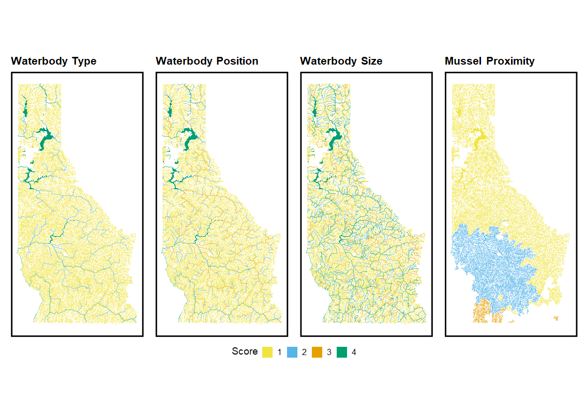

<script type="text/javascript">
$(document).ready(function () {
  window.initializeCodeFolding("show" === "hide");
});
</script>

```{r setup, include=FALSE}
knitr::opts_chunk$set(dev.args = list(png = list(type = "cairo")), fig.width = 11, fig.height = 7)
library(dplyr)
library(gt)
library(ggtext)


myColors <- c("#F0E442", "#56B4E9", "#E69F00", "#009E73")

names(myColors) <- factor(1:4)
# 
# waterbodies_idaho_final_social <- read_sf('data/simple_features.gpkg', layer = 'waterbodies_idaho_final_social')
# nhdplus_idaho_final_social <- read_sf('data/simple_features.gpkg', layer = 'nhdplus_idaho_final_social')

```


# Overview  

This is the GIS workflow that covers the social suitability methods used to generate Aquatic Invasive Species (AIS) prioritization in Idaho specifically the Nez-Perce/Clearwater and Idaho Panhandle National Forests. We used methods described by Montana Fish, Wildlife and Parks AIS prioritization for lotic and lentic environments to the best we could.  


```{r, eval=FALSE, echo=FALSE}
dummy_sf <- st_sfc(st_point(c(NA_real_, NA_real_)), crs = st_crs(nhdplus_idaho_final_social))

dummy_sf <- st_sf(waterbody_type = factor(1:4, levels = 1:4), geom = dummy_sf)

p1 <- ggplot() +
    geom_sf(data = dummy_sf, aes(color = waterbody_type, fill = waterbody_type), show.legend = F) +
    geom_sf(data = nhdplus_idaho_final_social , aes(color = factor(waterbody_type)), linewidth = .25, inherit.aes = F) +
    geom_sf(data = waterbodies_idaho_final_social , aes(fill = factor(waterbody_type)), linewidth = 0, inherit.aes = F) +
    scale_color_manual(values = myColors, guide = 'none',  name = 'Score') +
    scale_fill_manual(values = myColors, name = 'Score') +
    guides(fill = guide_legend(order = 3)) +
    resourceviz::custom_theme(map_void = 4) +
    labs(title = 'Waterbody Type') +
    theme(legend.position = 'bottom')

dummy_sf <- st_sfc(st_point(c(NA_real_, NA_real_)), crs = st_crs(nhdplus_idaho_final_social))

dummy_sf <- st_sf(waterbody_position = factor(1:4, levels = 1:4), geom = dummy_sf)

p2 <- ggplot() +
    geom_sf(data = dummy_sf, aes(color = waterbody_position, fill = waterbody_position), show.legend = F) +
    geom_sf(data = nhdplus_idaho_final_social , aes(color = factor(waterbody_position)), linewidth = .25, inherit.aes = F) +
    geom_sf(data = waterbodies_idaho_final_social , aes(fill = factor(waterbody_position)), linewidth = 0, inherit.aes = F) +
    scale_color_manual(values = myColors, guide = 'none',  name = 'Score') +
    scale_fill_manual(values = myColors, name = 'Score') +
    guides(fill = guide_legend(order = 3)) +
    resourceviz::custom_theme(map_void = 4) +
    labs(title = 'Waterbody Position') + 
    theme(legend.position = 'bottom')


dummy_sf <- st_sfc(st_point(c(NA_real_, NA_real_)), crs = st_crs(nhdplus_idaho_final_social))

dummy_sf <- st_sf(waterbody_size_rec = factor(1:4, levels = 1:4), geom = dummy_sf)

p3 <- ggplot() +
    geom_sf(data = dummy_sf, aes(color = waterbody_size_rec, fill = waterbody_size_rec), show.legend = F) +
    geom_sf(data = nhdplus_idaho_final_social , aes(color = factor(waterbody_size_rec)), linewidth = .25, inherit.aes = F) +
    geom_sf(data = waterbodies_idaho_final_social , aes(fill = factor(waterbody_size_rec)), linewidth = 0, inherit.aes = F) +
    scale_color_manual(values = myColors, guide = 'none',  name = 'Score') +
    scale_fill_manual(values = myColors, name = 'Score') +
    guides(fill = guide_legend(order = 3)) +
    resourceviz::custom_theme(map_void = 4) +
    labs(title = 'Waterbody Size') + 
    theme(legend.position = 'bottom')

dummy_sf <- st_sfc(st_point(c(NA_real_, NA_real_)), crs = st_crs(nhdplus_idaho_final_social))

dummy_sf <- st_sf(mussel_proximity = factor(1:4, levels = 1:4), geom = dummy_sf)


p4 <- ggplot() +
    geom_sf(data = dummy_sf, aes(color = mussel_proximity, fill = mussel_proximity), show.legend = F) +
    geom_sf(data = nhdplus_idaho_final_social , aes(color = factor(mussel_proximity)), linewidth = .25, inherit.aes = F) +
    geom_sf(data = waterbodies_idaho_final_social , aes(fill = factor(mussel_proximity)), linewidth = 0, inherit.aes = F) +
    scale_color_manual(values = myColors, guide = 'none',  name = 'Score', na.value = NA) +
    scale_fill_manual(values = myColors, name = 'Score', na.value = NA) +
    guides(fill = guide_legend(order = 3)) +
    resourceviz::custom_theme(map_void = 4) +
    labs(title = 'Mussel Proximity') + 
    theme(legend.position = 'bottom')

library(patchwork)

(p1|p2|p3|p4) + plot_layout(guides = 'collect') & theme(legend.position = 'bottom')

```


## Methods  

The methods used to generate the social suitability scores involve GIS processing in R and/or Python (eventually implementing). The challenging part was not necessarily the geospatial analysis but instead getting the data to work and relate together, e.g. waterbodies and streams/rivers. The first part of the vignette will go over the logic used for the waterbody type, size, and position and how to link them together using Hydrological Unit Codes (HUC) and National Hydrography Dataset Plus Version 2 (NHDPlus V2). This will then follow with the mussel proximity workflow using a road network to find how far away the recently (2023, Snake River near Twin Falls, Idaho) found mussel population is from the waterbodies and streams/rivers. We do not have any angler data or a proxy for this variable right now so this was left out of the analysis.  

Our goal with the vignette is to show the steps it took to get to the figure output below.  


```{r, echo = F, out.width='200%', fig.cap="Final social scores for the 4 metrics."}
  


```

### Data  

You'll need the waterbodies, flowlines and HUC 12's for Idaho via NDHPLus V2. This can be retrieved from various [sources](https://hydro.nationalmap.gov/arcgis/rest/services/NHDPlus_HR/MapServer) but was retrieved via the [nhdplusTools]() package in R. The waterbodies and flowlines will contain two different geometry types: POLYLINE (flowlines) and MULTIPOLYGON (waterbodies). So be aware when bringing it all together at the end for the final score and why some things are done certain ways.     

### Waterbody Type  

Waterbody type was calculated using the NHDPlus dataset and associated attribute streamorder (Strahler) for streams and rivers and acreage for the waterbodies. 


```{r, echo = F}
tribble(
  ~`Waterbody Type`, ~Score,
  'Stream/Creek', 1,
  'River', 2,
  'Hatchery water/ small lake < 25 ac',  3,
  'Lake > 25 ac or Very Large River', 4
) %>% 
  gt() %>% 
  data_color(
    columns = Score,
    palette = myColors
  )
  

```

```{r, eval=FALSE, "hide"}
library(sf)
library(tidyverse)

#### waterbodies_idaho and nhdplus_idaho are datasets retrieved prior to doing calculations....

waterbodies_idaho <- read_sf('data/simple_features.gpkg', layer = 'waterbodies_idaho')
nhdplus_idaho <- read_sf('data/simple_features.gpkg', layer = 'nhdplus_idaho')


waterbodies_idaho <- waterbodies_idaho %>% 
                      mutate(area_acres = as.numeric(units::set_units(sf::st_area(.), 'acres')),
                             waterbody_type = if_else(area_acres<25, 3, 4)
                              )

nhdplus_idaho <- nhdplus_idaho %>%
                      mutate(waterbody_type = if_else(streamorde <= 3,1,
                                                 if_else(streamorde >3 & streamorde <=5 , 2, 4)))
```


### Waterbody Size  

Waterbody size is used as a proxy for recreation with the idea that larger waterbodies and rivers will attract more use. We'll use the same datasets we used with `Waterbody Type`, but will calculate the `qts` quartiles for the waterbody part and group flowlines by name to get lengths.  

1. Get quartiles for the waterbodies.  

2. Get the length of flowlines based on `gnis_name`; meaning flowlines with names will be connected by length.  


```{r, echo = F}
tribble(
  ~`Waterbody Size`, ~Score,
  '<25% or <15km', 1,
  '26-50% or 16-30km', 2,
  '51-75% or 30-60km',  3,
  '>75% or >60km', 4
) %>% 
  gt() %>% 
  data_color(
    columns = Score,
    palette = myColors
  )
  

```


```{r, eval = F}

### waterbody size

qts <- quantile(waterbodies_idaho$area_acres)

waterbodies_idaho <- waterbodies_idaho %>% mutate(waterbody_size_rec = if_else(area_acres < qts[[2]], 1,
                                                                      if_else(area_acres >= qts[[2]] & area_acres < qts[[3]], 2,
                                                                              if_else(area_acres >= qts[[3]] & area_acres < qts[[4]], 3, 4))))

nhdplus_idaho <- nhdplus_idaho %>%
                  rowwise() %>%
                  mutate(gnis_name = if_else(gnis_name == ' ', as.character(paste0(paste0(sample(letters, 4), collapse = ''), '_', sample(1:100000000, 1))), gnis_name)) %>%
                  group_by(gnis_name) %>%
                  mutate(dist = sum(lengthkm)) %>%
                  ungroup() %>%
                  mutate(waterbody_size_rec = if_else(dist < 15, 1,
                                                      if_else(dist >= 15 & dist < 30, 2,
                                                              if_else(dist >= 30 & dist < 60, 3, 4))))
```


### Waterbody Position  

Waterbody position was a little trickier for waterbodies (lakes) than the flowlines. There really isn't a great way to differentiate between the two besides elevation, which is not fully populated with the waterbodies dataset. To account for mountain lake or reservoir (score 3), I just took the elevation of the waterbodies centroid when available andand if no value then it was a larger lake likely in the lowland. This is definitely not perfect, but works for .


```{r, echo = F}
tribble(
  ~`Waterbody Position`, ~Score,
  'Mountain Stream', 1,
  'Lowland/Prairie Stream', 2,
  'Mountain Lake/Reservoir or Lowland/Prairie River',  3,
  'Lowland Lake/Reservoir', 4
) %>% 
  gt()%>% 
  data_color(
    columns = Score,
    palette = myColors
  )
  

```

```{r, eval = FALSE}

# from visual inspection we can see that lakes with > 300 acres are likely lowland waterbodies

waterbodies_idaho <- waterbodies_idaho %>% 
                        mutate(waterbody_position = if_else(area_acres > 300, 4, NA_real_))

# now get elevations for the ones that are below 300

waterbodies_idaho_filtered <- waterbodies_idaho %>% 
                            filter(is.na(waterbody_position)) %>% 
                            st_centroid() %>%
                            select(-elevation) %>%
                            elevatr::get_elev_point()

waterbodies_idaho_filtered <- bind_cols( waterbodies_idaho %>% filter(is.na(waterbody_position)) %>% 
                                         select(id, comid) %>% st_drop_geometry(),
                                         waterbodies_idaho_filtered %>% select(ele = 'elevation') %>% 
                                         st_drop_geometry())

# then join back with original

### just visually looked at the patterns and most valleys are below 1600 and high mountain lake are above

waterbodies_idaho <- waterbodies_idaho %>% 
                     left_join(waterbodies_idaho_filtered) %>% 
                     mutate(waterbody_position = ifelse(!is.na(waterbody_position), waterbody_position,
                                                         ifelse(ele > 1500, 3, 4)))

nhdplus_idaho <- nhdplus_idaho %>%
  mutate(waterbody_position = if_else(streamorde <= 2, 1,
                                      if_else(streamorde > 2 & streamorde <=3, 2,
                                          if_else(streamorde > 3 & streamorde <=5 , 3, 4))))


```


### Mussel Proximity  

Mussel proximity involves calculating the distance via roadways to the nearest mussel population. In Idaho this is the Snake River near Twin Falls but could change so updating will be important. Below is the workflow used to create a road network and then calculate the cost distance from that affected area.  

```{r, echo = F}
tribble(
  ~`Mussel Proximity`, ~Score,
  '> 400 miles', 1,
  '300-400 miles', 2,
  '200-300 miles',  3,
  '< 200 miles', 4
) %>% 
  gt()%>% 
  data_color(
    columns = Score,
    palette = myColors
  )
  

```


First we'll need to have a roadnetwork that is cleaned. What I mean be _clean_ is a network that has no multiples, loops, or missing vertices when crossing over other lines. There are a few ways to do this but I'd recommend using the `planarize` tool in `ArcPro` to be able to do this quickly (need to find a R alternative).  
```{r, eval=FALSE}

library(sfnetworks)
library(arcgis)
library(purrr)
library(tidygraph)

idaho <- AOI::aoi_get(stat = 'Idaho')

id_roads_sf <- arc_select(arc_open('https://gisportalp.itd.idaho.gov/xserver/rest/services/RH_GeneralService/MapServer/1/'))%>%
  st_transform(3742)

### this is because of an empty geometry; hopefully you won't have to deal with....
empty_geom <- id_roads_sf %>% st_geometry() %>% map(~is_empty(.x))

id_roads_sf$empty_geom <- unlist(empty_geom)

id_roads_sf <- id_roads_sf %>% filter(empty_geom == FALSE)

# you'll need to figure out how to get your usfs simple feature; here it was local for me.

usfs_roads <- read_sf('Z:/simple_features/roads/r1_rd_core.shp') %>% st_intersection(st_transform(idaho, st_crs(.)))%>%
  st_transform(3742)

roads_together <- bind_rows(id_roads_sf%>% filter(SystemCode != 'FD'), usfs_roads) %>% st_as_sf() %>% st_cast('LINESTRING')

########### Or bring in a clean version of the roads for your AOI ########

#roads_mt_id_clean <- read_sf('data/road_mt_id_fs.shp')

# get the mussel locations
mussel_point <- mapedit::drawFeatures() %>% st_transform(crs = st_crs(usfs_roads))

# create a network and check for errors.... 

# set to conda env
reticulate::use_condaenv(r'{C:\Program Files\ArcGIS\Pro\bin\Python\envs\arcgispro-py3}')

arcpy <- reticulate::import('arcpy')

write_sf(roads_together, paste0(getwd(), '/data/together_roads.shp'))

arcpy$env$workspace = paste0(getwd(), '/data')

arcpy$CreateFileGDB_management(out_name = 'roads.gdb', out_folder_path = arcpy$env$workspace)

arcpy$FeatureToLine_management(in_features =  paste0(getwd(), '/data/together_roads.shp'), out_feature_class = 'roads.gdb/together_roads', cluster_tolerance = '5 Meters')

roads_together <- read_sf('data/roads.gdb', layer = 'together_roads') %>% st_cast("LINESTRING")

# also convert to a crs that is good for north to south, etc. 3742 EPSG for Idaho UTM 12

net <- as_sfnetwork(roads_together, directed = FALSE) %>%
  activate("edges") %>%
  mutate(weight = edge_length()) %>%
  filter(!tidygraph::edge_is_multiple()) %>%
  filter(!tidygraph::edge_is_loop())


```

Once we have a clean network, then we can start by getting the distances from the affected area (`mussel_point`). Depending on the CRS and projection you'll want to adjust for the distances and also the final metric, which is miles in our case.  

```{r, eval = F}
# get the distances between the mussel_point and the nodes in the network

distances <- sfnetworks::st_network_cost(net, from = mussel_point, weights = 'weight')

# now get the 'from' in the network
edged_start <- net %>% activate('edges') %>% pull(from)

# convert infinite to numeric
net_final <- net %>% 
             activate('edges') %>% 
             mutate(new_weight = map(edged_start, ~as.numeric(if_else(is.infinite(distances[[.x]]), NA_real_, as.numeric(distances[[.x]])))))

# convert from meters to miles
net_final_edges <- net_final %>% activate('edges') %>% 
                   mutate(new_weight = unlist(new_weight),
                   new_weight = ifelse(is.infinite(new_weight), NA_real_, new_weight),
                   new_weight_miles = as.numeric(new_weight*0.000621371)) %>% 
                   select(-new_weight) %>% st_as_sf()


```

Now we have a network of roads and the shortest path from the mussel location.  

```{r, echo=FALSE, out.width='200%'}
knitr::include_graphics('www/images/mussel_proximity.png')
```

A way to link these road network distances from `mussel_point` would be to find the closest waterbody and then snap together. This is a more precise and accurate way of doing this but is heavily intensive but likely not gaining much more insight, i.e. we are dealing with miles. Thus, we'll take the HUC 12 that the road intersects and use as a surrogate for distance by taking the mean of all distances. Then we can join back to the original datasets `waterbodies_idaho` and `nhdplus_idaho`. This will help having a HUC 12 linked with these datasets not only for distance but also for the other suitability score _habitat_. It's not perfect and has it's flaws but is an  efficient way of getting this indicator score. Another issue is that getting all of the road data can be difficult. There are places that show up on satellite imagery as having roads but the state and government road layers are not there. 

```{r, eval = F}
# adding huc12s and aggregating with a mean distance will make it easier for joining and not a lot of information lost

# now combined with HUCS to make easier.

huc12 <- read_sf('data/simple_features.gpkg', layer = 'huc12')

huc_list <- st_intersects(net_final_edges, st_transform(huc12, crs = st_crs(net_final_edges)))

huc_list <- map_vec(huc_list, ~ifelse(is.null(.x), NA, .x))

huc12s <- huc12[huc_list,]$huc12

# now add back to the network
net_final_edges$huc12 <- huc12s

distance_by_huc <- net_final_edges %>% group_by(huc12) %>% summarise(mean_dist = mean(new_weight_miles, na.rm = TRUE)) %>% 
  ungroup() %>% st_as_sf() %>% st_drop_geometry() %>% select(huc12, mean_dist)

distance_by_huc <- distance_by_huc %>% mutate(
  mussel_proximity = case_when(
    mean_dist > 400 ~ 1,
    mean_dist > 300 & mean_dist <= 400 ~ 2,
    mean_dist > 200 & mean_dist <= 300 ~ 3,
    mean_dist <= 200 ~ 4, 
    TRUE ~ NA_real_
  )
)

# Need to get centroid of lakes and then associated HUC12s

lake_list <- st_centroid(waterbodies_idaho) %>% st_intersects(huc12)

lake_list <- map_vec(lake_list, ~ifelse(is.null(.x), NA, .x))

huc12s <- huc12[lake_list,]$huc12

waterbodies_idaho$huc12 <- huc12s

# we'll need to get COMIDs and HUC12 codes

# download from online https://www.sciencebase.gov/catalog/item/57eaa10fe4b09082500db04e
huc_comid <- read_sf(r'{Z:\Downloads\HUC12_PU_COMIDs_CONUS\HUC12_PU_COMIDs_CONUS.dbf}') %>% janitor::clean_names()

nhdplus_idaho <- nhdplus_idaho %>% left_join(huc_comid %>% select(comid, huc12))

# now join back with the waterbodies and nhdplus datasets

nhdplus_idaho <- nhdplus_idaho %>% left_join(distance_by_huc, by = 'huc12')

waterbodies_idaho <- waterbodies_idaho %>% left_join(distance_by_huc, by = 'huc12')


```

Finally, to make this complete we need to account for the areas that are NA's and within Forest Service land and give them a `1` since these are likely wildnerness areas.  

```{r ,eval=FALSE}
### bring in your own admin units layer
fs_lands <- read_sf('Z:/fisheries/btbaseline/data/bt_baseline.gpkg', layer = 'admin_units') %>% st_transform(crs = 4326)

npcw_idph <- fs_lands %>% filter(FORESTNAME %in% c('Nez Perce-Clearwater National Forest','Idaho Panhandle National Forests')) %>%
  st_make_valid() %>% st_union()

### get for nhdplus
wild_water <- nhdplus_idaho %>% st_intersects(npcw_idph)

wild_water <- map_vec(wild_water, ~ifelse(is.null(.x), NA, .x))

nhdplus_idaho$fs_land <- wild_water

### now for waterbodies

wild_water <- waterbodies_idaho %>% st_intersects(npcw_idph)

wild_water <- map_vec(wild_water, ~ifelse(is.null(.x), NA, .x))

waterbodies_idaho$fs_land <- wild_water


### bring it all together
nhdplus_idaho_final_social <- nhdplus_idaho %>% mutate(mussel_proximity = if_else(is.na(mussel_proximity) & fs_land == 1, 1, mussel_proximity))

waterbodies_idaho_final_social <- waterbodies_idaho %>% mutate(mussel_proximity = if_else(is.na(mussel_proximity) & fs_land == 1, 1, mussel_proximity))

waterbodies_idaho_final_social %>% 
  st_intersection(idaho) %>% 
  mutate(mussel_proximity = if_else(is.na(mussel_proximity), 4, mussel_proximity)) %>% # clean up areas on other forests
  write_sf('data/simple_features.gpkg', layer = 'waterbodies_idaho_final_social', delete_layer = T)

nhdplus_idaho_final_social  %>% 
  st_intersection(idaho) %>% 
  nhdplus_idaho_final_social %>% 
  mutate(mussel_proximity = if_else(is.na(mussel_proximity), 4, mussel_proximity)) %>% # clean up areas on other forests
  write_sf('data/simple_features.gpkg', layer = 'nhdplus_idaho_final_social', delete_layer = T)

```


