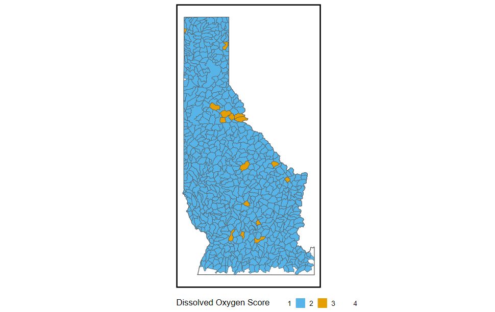

```{r, include = FALSE}
knitr::opts_chunk$set(
  collapse = TRUE,
  comment = "#>"
)
library(tidyverse)
library(gt)

myColors <- c("#F0E442", "#56B4E9", "#E69F00", "#009E73")

names(myColors) <- factor(1:4)
```


# Overview    

This is a report that covers the methods used to generate Aquatic Invasive Species (AIS) prioritization in Idaho specifically the Nez-Perce/Clearwater and Idaho Panhandle National Forests. We used methods described by Montana Fish, Wildlife and Parks AIS prioritization lotic and lentic environments to the best we could. Some of the input data is difficult to retrieve due to lack of collection and various sources, thus there are data gaps that would likely help with these methods.    


## Social Suitability Score Criteria  {.tabset .tabset-pills}  

The Social Suitability Score is broken into 5 different indicators of potential risk of invasion via social players. These factors are then stratified into categories 1-4 based on different thresholds (see Tables below). These scores are then used for the final risk score by adding to the Habitat Suitability Score. 


### something

laskjdf;lsakdjf;laksjd


:::: {style="display: flex;"}

::: {style="flex-basis: 500%;"}
```{r, echo=F, out.width='200%',message=FALSE, warning=FALSE, error=FALSE}

x <- rnorm(1000)
y <- rnorm(1000, 0.2, 1.2)

plot(x, y)
```

:::

::: {style="flex-basis: 250%;"}  

```{r, echo = F}
tribble(
  ~`Waterbody Type`, ~Score,
  'Stream/Creek', 1,
  'River', 2,
  'Hatchery water/ small lake < 25 ac',  3,
  'Lake > 25 ac or Very Large River', 4
) %>% 
  gt() %>% 
  data_color(
    columns = Score,
    palette = myColors
  )
  

```

:::

::::


```{r, echo=F,out.width='200%',  fig.align='center'}


# dummy_sf <- st_sfc(st_point(c(NA_real_, NA_real_)), crs = st_crs(final_stream))
# 
# dummy_sf <- st_sf(do_model = factor(1:4, levels = 1:4), geom = dummy_sf)
# 
# ggplot() +
#     geom_sf(data = dummy_sf, aes(color = do_model, fill = do_model), show.legend = F) +
#     geom_sf(data = final_stream , aes(color = factor(do_model)), linewidth = .25, inherit.aes = F) +
#     geom_sf(data = final_lakes , aes(fill = factor(do_model)), linewidth = 0, inherit.aes = F) +
#     scale_color_manual(values = myColors, guide = 'none',  name = 'Stream Temperature Score') +
#     scale_fill_manual(values = myColors, name = 'Dissolved Oxygen Score') +
#     guides(fill = guide_legend(order = 3)) +
#     resourceviz::custom_theme(map_void = 4) +
#     theme(legend.position = 'bottom')



```

### i don't know  

;asdkjf;saldkj;aslk


## NEw stablkjs {.tabset .tabset-pill}  

LSKjfglsdkjfl;sdkjf;lksjdfl;askd
sdafsdafljsadlfkas
df
sadfjsdkalflsdakf


### Trying something  


:::: {style="display: flex;"}

::: {style="flex-basis: 500%;"}
```{r, echo=F, out.width='200%',message=FALSE, warning=FALSE, error=FALSE}

x <- rnorm(1000)
y <- rnorm(1000, 0.2, 1.2)

plot(x, y)
```

:::

::: {style="flex-basis: 250%;"}
```{r, echo = F}
tribble(
  ~`Waterbody Type`, ~Score,
  'Stream/Creek', 1,
  'River', 2,
  'Hatchery water/ small lake < 25 ac',  3,
  'Lake > 25 ac or Very Large River', 4
) %>% 
  gt() %>% 
  data_color(
    columns = Score,
    palette = myColors
  )
  

```

:::

::::  


```{r, echo=F,out.width='200%',  fig.align='center'}


# dummy_sf <- st_sfc(st_point(c(NA_real_, NA_real_)), crs = st_crs(final_stream))
# 
# dummy_sf <- st_sf(do_model = factor(1:4, levels = 1:4), geom = dummy_sf)
# 
# ggplot() +
#     geom_sf(data = dummy_sf, aes(color = do_model, fill = do_model), show.legend = F) +
#     geom_sf(data = final_stream , aes(color = factor(do_model)), linewidth = .25, inherit.aes = F) +
#     geom_sf(data = final_lakes , aes(fill = factor(do_model)), linewidth = 0, inherit.aes = F) +
#     scale_color_manual(values = myColors, guide = 'none',  name = 'Stream Temperature Score') +
#     scale_fill_manual(values = myColors, name = 'Dissolved Oxygen Score') +
#     guides(fill = guide_legend(order = 3)) +
#     resourceviz::custom_theme(map_void = 4) +
#     theme(legend.position = 'bottom')


```
